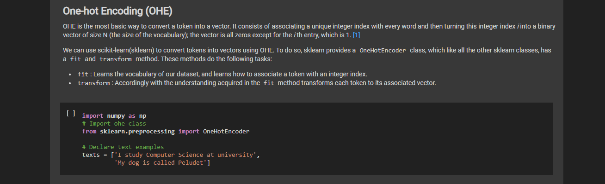
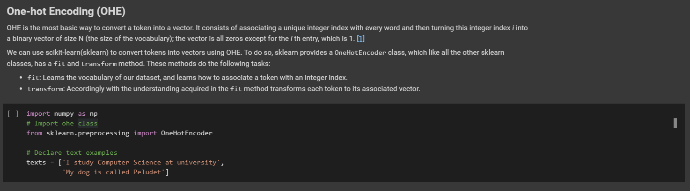

# Jupyter nbconvert template

Template to export jupyter notebook as html using nbconvert. 

This template simulates [google colab dark theme](https://colab.research.google.com/).

## Jupyter notebook in html



## Google Colab original



## Try yourself

1. Clone github project and cd into examples folder

```bash
$ git clone https://github.com/Guillem96/jupyter-colab-like-template.git
$ cd jupyter-colab-like-template
```

2. Install jupyter

```bash
$ pip install jupyter
```

3. Convert the notebook to html

```bash
$ jupyter nbconvert playing_word_embeddings.ipynb --to html --template ../template.html
[NbConvertApp] Converting notebook playing_word_embeddings.ipynb to html
[NbConvertApp] Writing 683337 bytes to playing_word_embeddings.html
```

4. Open the `playing_word_embeddings.html` with your default browser.
